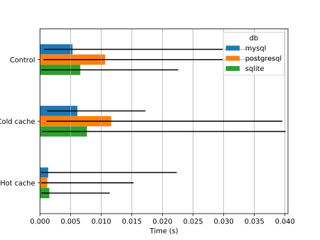
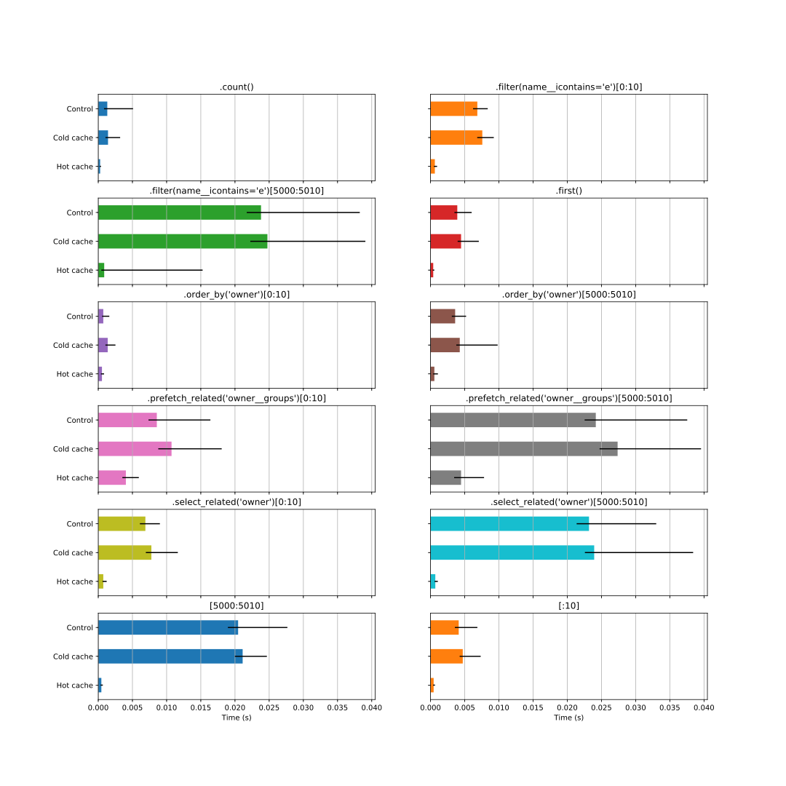
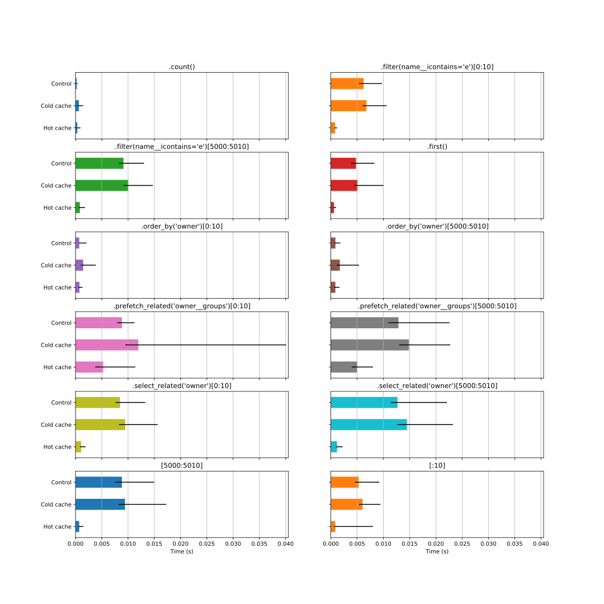
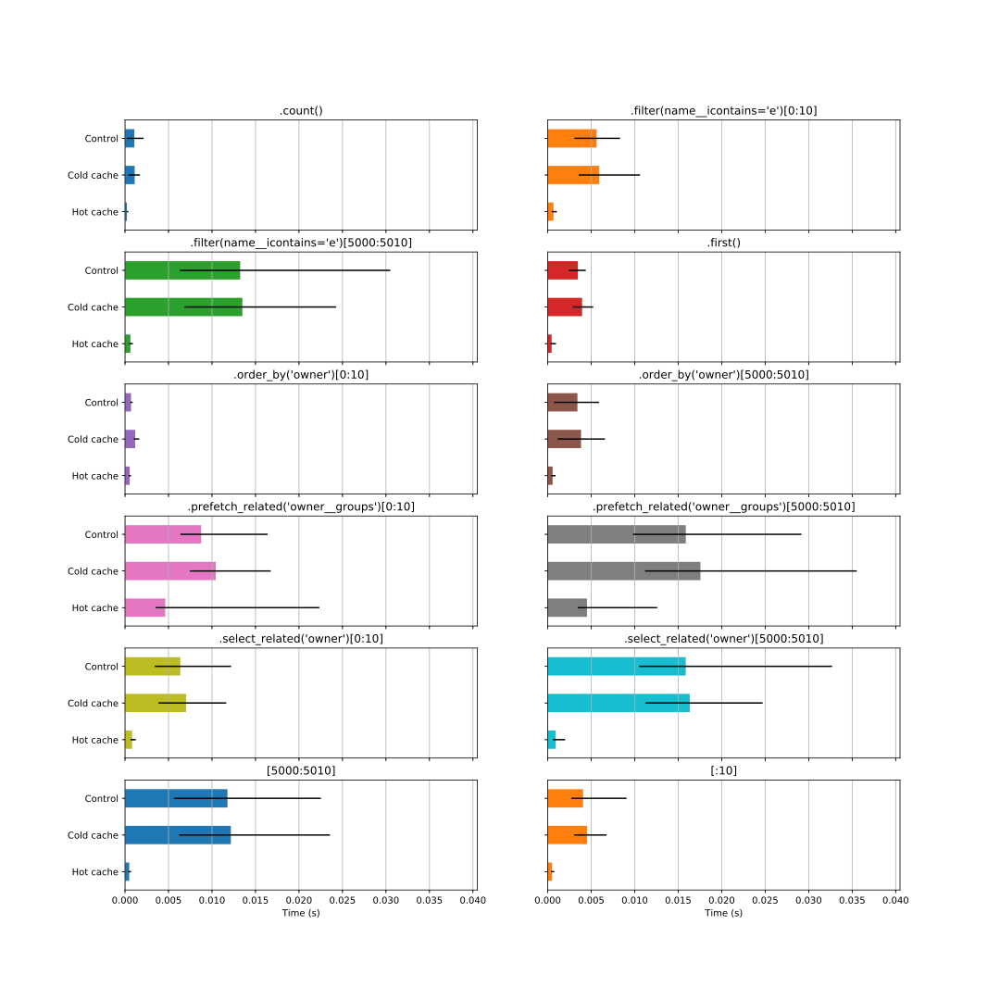
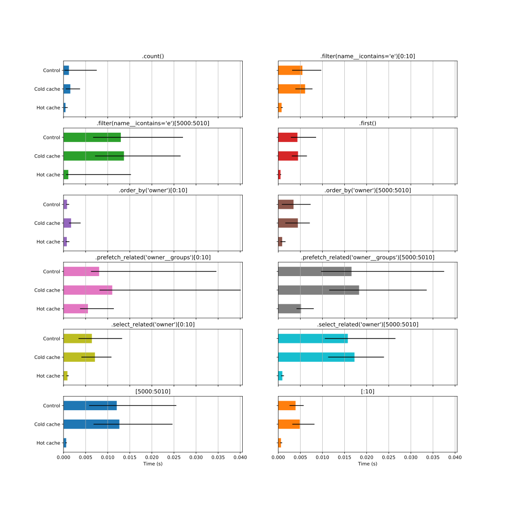
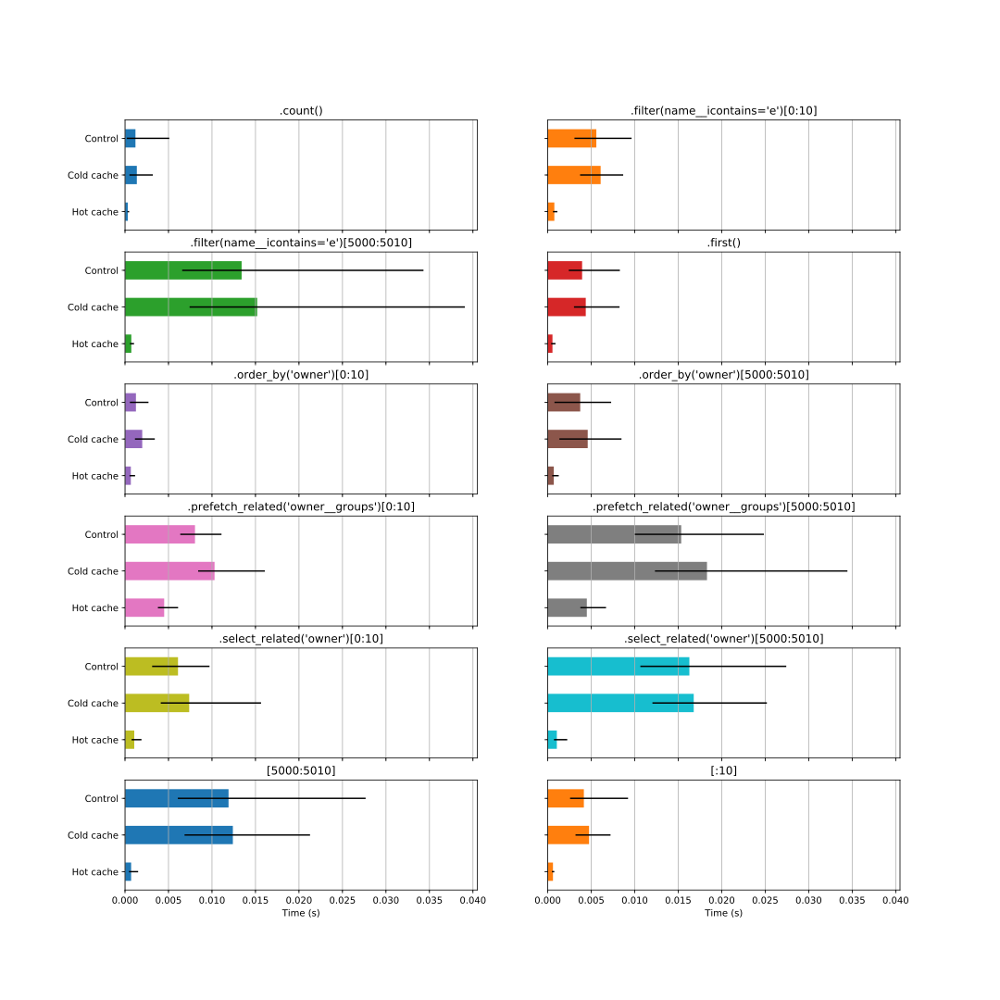

.. _Benchmark:

Benchmark
---------

.. contents::

Introduction
............

This benchmark does not intend to be exhaustive nor fair to SQL.
It shows how django-cachalot behaves on an unoptimised application.
On an application using perfectly optimised SQL queries only,
django-cachalot may not be useful.
Unfortunately, most Django apps (including Django itself)
use unoptimised queries. Of course, they often lack useful indexes
(even though it only requires 20 characters per index…).
But what you may not know is that
**the ORM currently generates totally unoptimised queries** [#]_.

You can run the benchmarks yourself (officially supported on Linux
and Mac). You will need a database called "cachalot" on MySQL and PostgreSQL.
Additionally, on PostgreSQL, you will need to create a role
called "cachalot." Running the benchmarks can raise
errors with specific instructions for how to fix it.

#. Install: ``pip install -r requirements/benchmark.txt``
#. Run: ``python benchmark.py``

The output will be in benchmark/TODAY'S_DATE/

Conditions
..........

.. include:: ../benchmark/docs/2018-08-09/conditions.rst

Note that
`MySQL’s query cache <http://dev.mysql.com/doc/refman/5.7/en/query-cache.html>`_
is active during the benchmark.

Database results
................

.. include:: ../benchmark/docs/2018-08-09/db_results.rst

Cache results
.............

.. include:: ../benchmark/docs/2018-08-09/cache_results.rst

.. image:: ../benchmark/docs/2018-08-09/cache.svg

Database detailed results
.........................

MySQL
~~~~~

.. image:: ../benchmark/docs/2018-08-09/db_mysql.svg

PostgreSQL
~~~~~~~~~~

SQLite
~~~~~~

Cache detailed results
......................

File-based
~~~~~~~~~~

.. image:: ../benchmark/docs/2018-08-09/cache_filebased.svg

Locmem
~~~~~~

Memcached (python-memcached)
~~~~~~~~~~~~~~~~~~~~~~~~~~~~

Memcached (pylibmc)
~~~~~~~~~~~~~~~~~~~

.. image:: ../benchmark/docs/2018-08-09/cache_pylibmc.svg

Redis
~~~~~

.. [#] The ORM fetches way too much data if you don’t restrict it using
       ``.only`` and ``.defer``. You can divide the execution time
       of most queries by 2-3 by specifying what you want to fetch.
       But specifying which data we want for each query is very long
       and unmaintainable. An automation using field usage statistics
       is possible and would drastically improve performance.
       Other performance issues occur with slicing.
       You can often optimise a sliced query using a subquery, like
       ``YourModel.objects.filter(pk__in=YourModel.objects.filter(…)[10000:10050]).select_related(…)``
       instead of ``YourModel.objects.filter(…).select_related(…)[10000:10050]``.
       I’ll maybe work on these issues one day.
