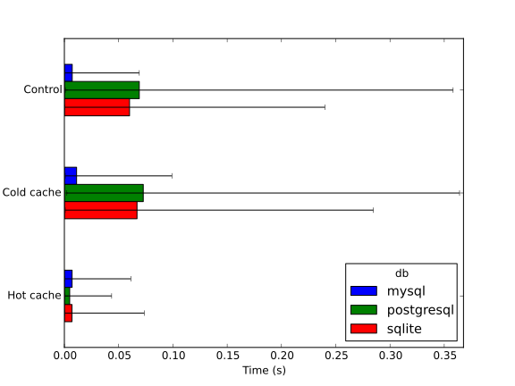
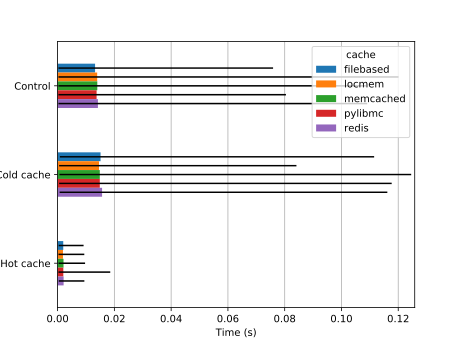
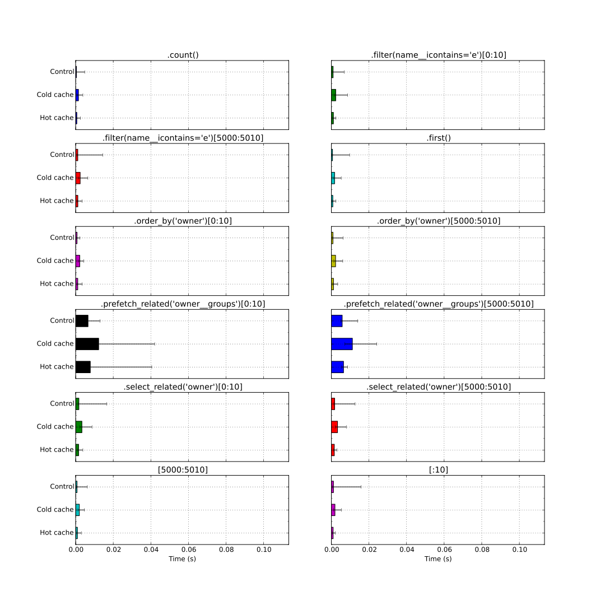
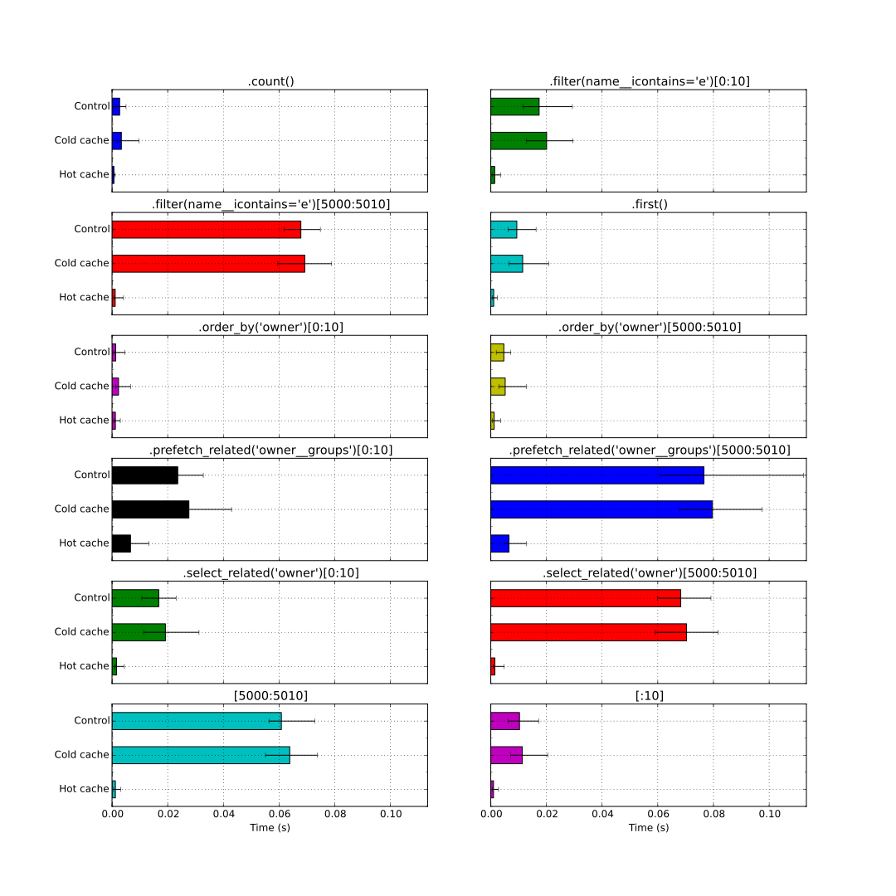
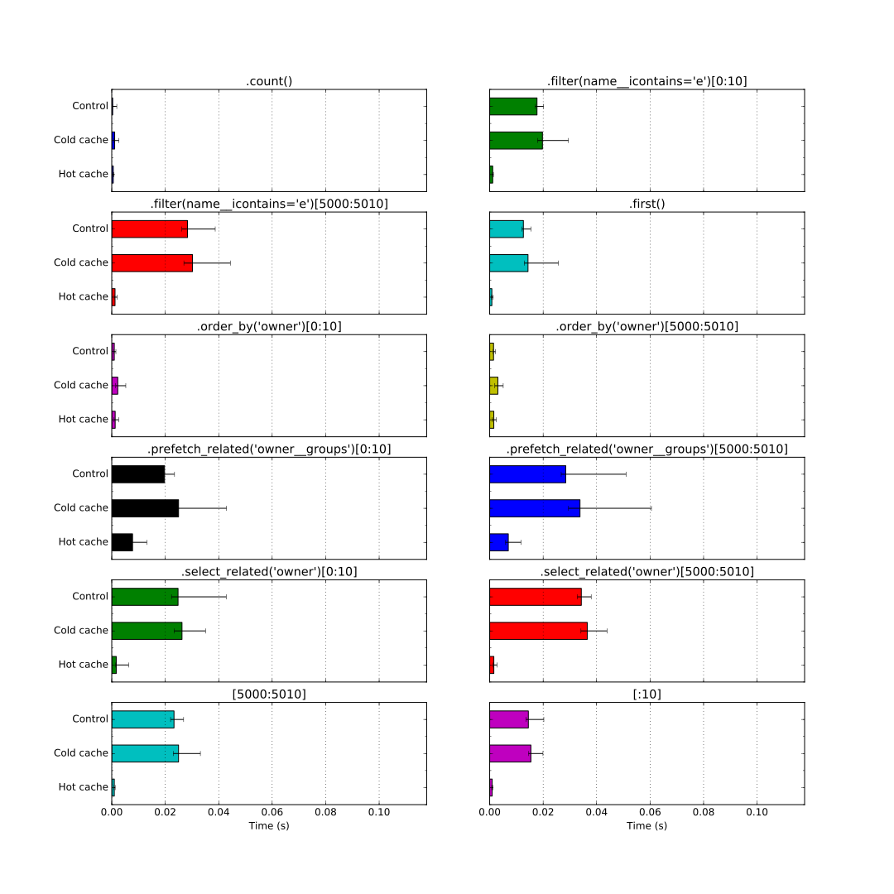
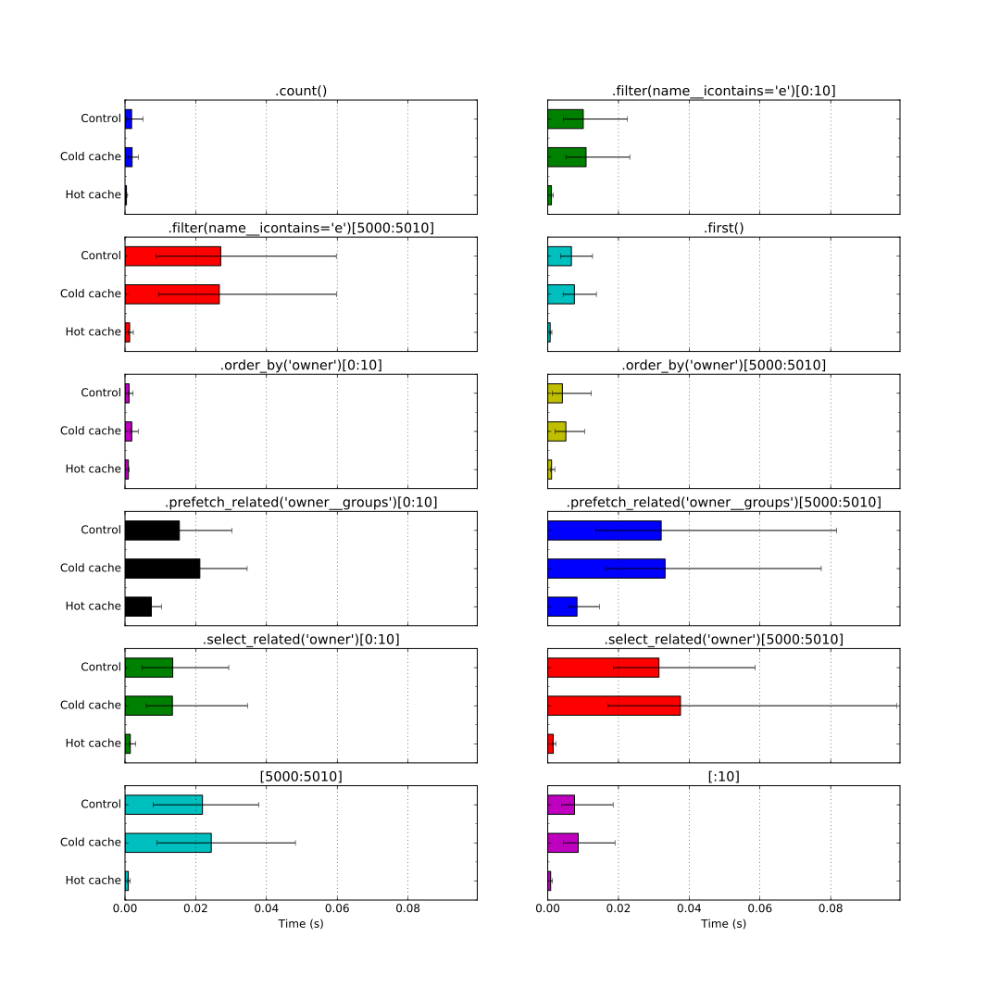
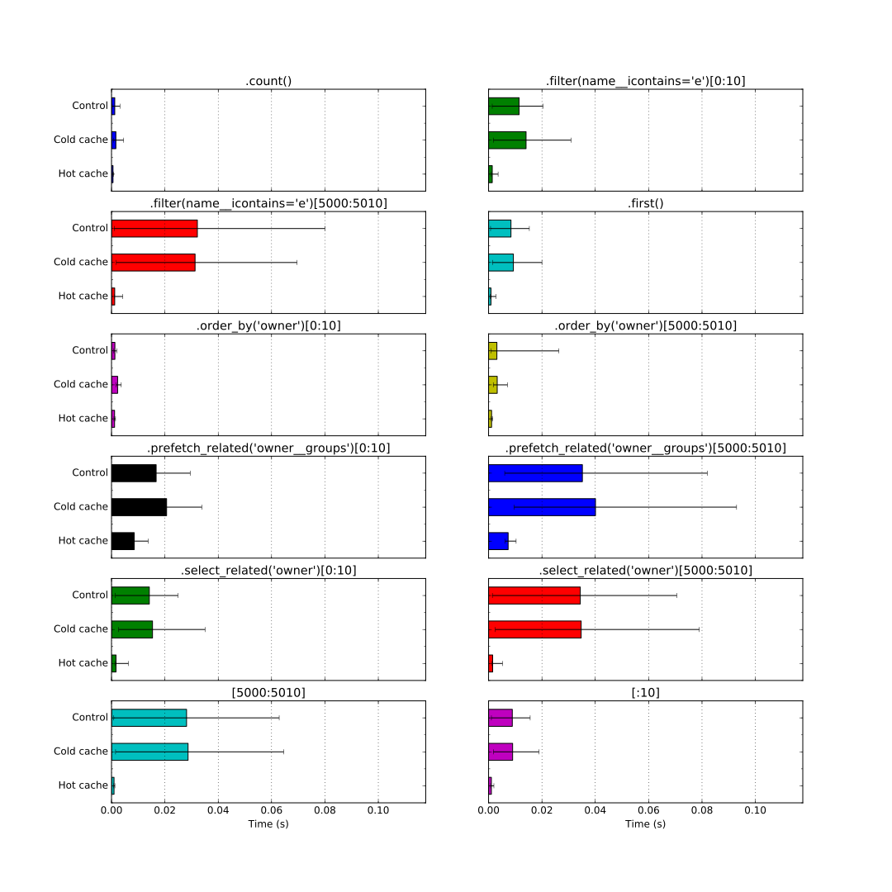
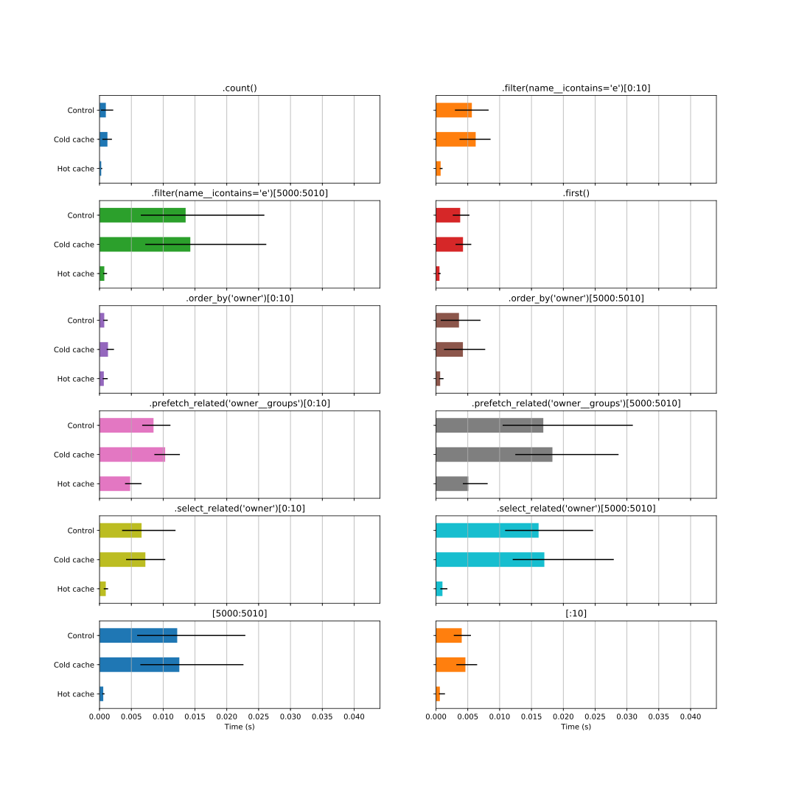
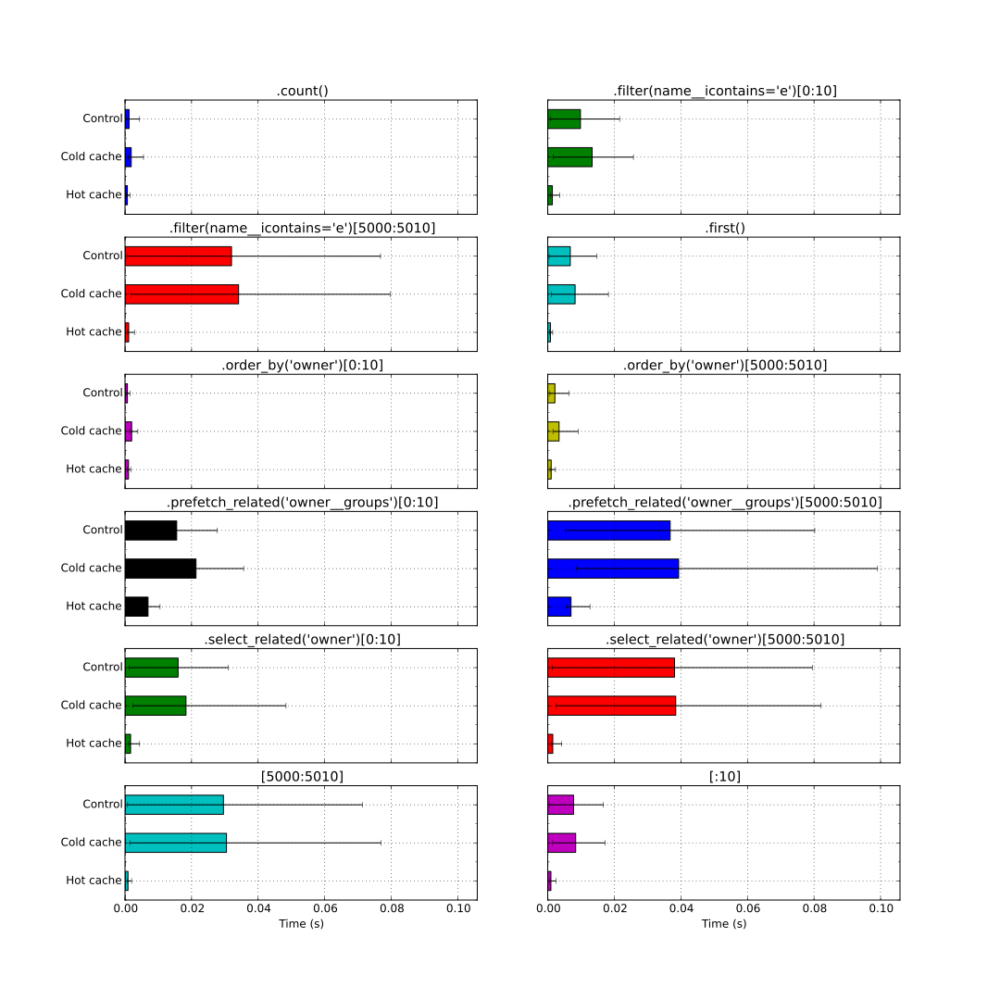

Benchmark
---------

.. contents::

Database results
................

.. include:: ../benchmark/db_results.rst

Cache results
.............

.. include:: ../benchmark/cache_results.rst

Database detailed results
.........................

MySQL
~~~~~

PostgreSQL
~~~~~~~~~~

SQLite
~~~~~~

Cache detailed results
......................

File-based
~~~~~~~~~~

Locmem
~~~~~~

Memcached (python-memcached)
~~~~~~~~~~~~~~~~~~~~~~~~~~~~

Memcached (pylibmc)
~~~~~~~~~~~~~~~~~~~

Redis
~~~~~

